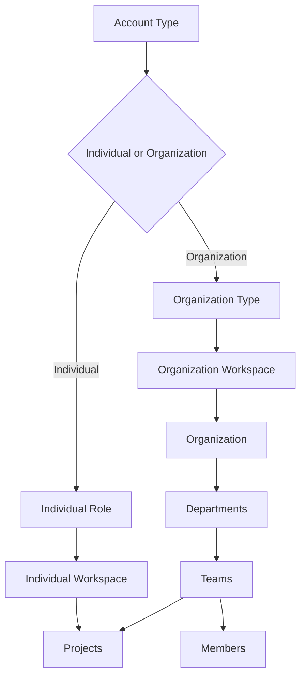

# Account And Workspace Architecture

## Canonical Model

Only `individual` and `organization` are account types. Individual roles describe a person's working perspective. Organization types classify a legal or operating organization and are never stored as user roles.

## Typed Identity

An individual identity has `accountType = individual`, one `primaryRole`, and no `organizationType`. An organization identity has `accountType = organization`, one `organizationType`, and no `primaryRole`.

Workspace identifiers are explicit and derived from the complete identity. They are not permission identifiers and must not be used for authorization.

## Navigation And Permissions

Navigation is presentation configuration derived from account identity in `lib/onboarding.ts`. It decides which relevant destinations to display. Authorization remains derived from organization membership, organization role permissions, ownership, and existing RLS helpers. Hiding a navigation item never grants or revokes access.

## Organization Hierarchy

The canonical operational hierarchy is:

`Organization -> Department -> Team -> Team Member -> Project`

`organization_teams.department_id` links teams to departments. `organization_team_members.organization_member_id` ensures team participation originates from organization membership. `projects.team_id` supports team ownership while the existing `projects.organization_id` remains during migration for compatibility and RLS scope.

## Compatibility

Legacy `primary_role = company` records are converted to organization accounts with `organization_type = construction_company`. Existing projects keep their organization relationship and may receive a team gradually. No project, profile, membership, or organization is deleted.

## Migration

Apply `database/migrations/20260730_account_workspace_architecture_refinement.sql` only after the earlier onboarding migration. The migration adds columns and hierarchy tables, transforms legacy identifiers, updates constraints, adds indexes and RLS, and validates that an assigned project team belongs to the same organization.
